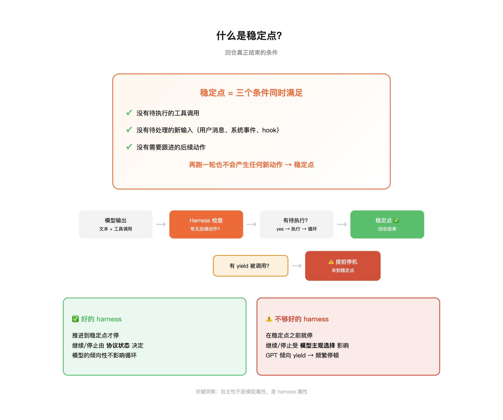
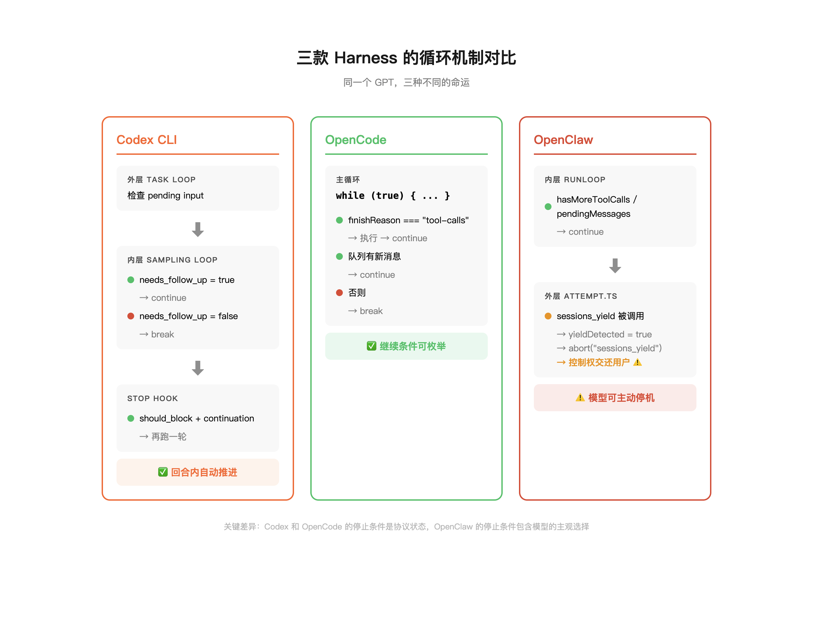

> **TL;DR** — 自主性不是模型属性，是 harness 属性。GPT 在 OpenClaw 里频繁停下来等你说继续，不是因为 GPT 笨，而是因为 OpenClaw 的外层提供了 `sessions_yield` 这个显式停机工具，而 GPT 恰好倾向于使用它。同一个 GPT 放到 Codex CLI 或 OpenCode 里，它会一路推进到稳定点才停。本文通过对三个 harness 源码的机制对照，把这个体感差异定位到了具体的代码行。

## 症状

用 OpenClaw 跑 GPT 系列模型的人大概都遇到过这种情况：你给了一个明确的任务，agent 做到一半停了下来，说了一句类似"接下来你想让我怎么做？"或者"如果你需要我继续，请告诉我"。你说继续，它又做了一步，然后又停了。

这个体验很容易让人归因到模型本身——GPT 不够主动，GPT 的 instruction following 不行，GPT 不如 Claude 有自主性。社区里确实也有大量这样的讨论。

但如果你把同一个 GPT 模型放到 Codex CLI 里跑，它不会停。放到 OpenCode 里跑，它也不会停。它会一路推进到所有工具调用都执行完、没有后续动作了才停下来。

同一个模型，不同的行为。所以问题不在模型上。问题在 harness 上。

## 什么是 harness

Harness 是包裹在模型外面的那一层运行时。模型本身只做一件事：给定一段上下文，输出下一段文本（可能包含工具调用）。但模型不负责执行工具、不负责把执行结果喂回去、不负责判断任务有没有完成。这些全是 harness 的工作。

一个 agent 的自主性——它能不能在没有人工干预的情况下把一个多步任务推进到完成——几乎完全取决于 harness 的循环机制。具体来说，取决于三件事：

1. **循环怎么写的**：模型输出了工具调用之后，harness 是自动执行然后把结果喂回去继续跑，还是停下来等用户确认？
2. **继续条件是什么**：什么情况下 harness 认为还没完、需要继续跑一轮？
3. **停止条件是什么**：什么情况下 harness 认为这一回合结束了？

## 稳定点

要理解 harness 的行为，有一个概念绕不过去：**稳定点**（fixed point）。

一个回合真正结束的条件，不是模型说了一句话，也不是模型没有再调工具。准确地说，稳定点是这样一种状态：

- 没有待执行的工具调用
- 没有待处理的新输入（用户消息、系统事件、hook 注入）
- 没有需要跟进的后续动作

再跑一轮也不会产生任何新动作。系统状态不再变化。这就是稳定点。

一个好的 harness 会推进到稳定点才停。一个不够好的 harness 可能在到达稳定点之前就停下来了——不是因为任务完成了，而是因为某个机制打断了循环。

## 三个 harness 的对照

### Codex CLI

Codex CLI（codex-rs）的循环写在 Rust 里，结构是双层的。

外层是 Task loop。它检查 session 里有没有 pending input（待处理的输入），有就继续跑 turn。

内层是 Sampling loop。每次 `run_turn`，模型的输出经过解析，如果 `SamplingRequestResult.needs_follow_up` 为 true——也就是还有工具调用需要执行或者还有中间状态需要推进——就继续。

还有一个细节：stop hook。当某些条件触发了停止（比如安全策略拦截），如果 hook 判断 `should_block` 但给了一个 continuation prompt，Codex 会把这个 prompt 写回 history 然后**再跑一轮**。也就是说，即使是被拦截的情况，它也会尝试给模型一个收尾的机会，而不是直接切断。

关键代码在 `codex-rs/core/src/tasks/regular.rs` 和 `codex-rs/core/src/codex.rs`。

结论：Codex 把"继续"做成了回合内的协议状态。继续还是停止，是代码里的 `bool` 字段决定的，不是用户在终端里敲的回车。

### OpenCode

OpenCode 的循环写在 TypeScript 里，更直白：`while (true)`。

继续条件有两个：
1. `(await stream.finishReason) === "tool-calls"`——模型的输出包含工具调用，执行完结果喂回去，`continue`。
2. 队列里有比当前结果更新的消息（用户在 agent 跑的过程中又发了新指令），`continue`。

不满足这两个条件，才 `break`。

它的事件流（`/event` SSE 端点）只负责把过程推送给前端观测，不参与循环推进。循环完全在服务端跑。

关键代码在 `packages/opencode/src/session/prompt.ts`。

结论：OpenCode 的继续条件是可枚举的协议字段。UI 是订阅者，不是决策者。

### OpenClaw

OpenClaw 的情况更复杂，因为它有两层。

内层是 `pi-agent-core` 的 `runLoop`。这一层其实**天生就能自驱**：只要 `hasMoreToolCalls || pendingMessages.length > 0`，就继续。工具调用执行完，结果注入上下文，下一轮 LLM call。还有一个 follow-up 机制：当 agent 本该停止的时候，检查有没有新的后续消息，有就继续。

这一层的逻辑跟 Codex CLI 和 OpenCode 是同一个范式。如果只有这一层，GPT 在 OpenClaw 里也不会停。

但 OpenClaw 有外层。外层引入了 `sessions_yield`——一个显式的停机工具。当 agent 调用 `sessions_yield` 时，外层的 `attempt.ts` 会设置 `yieldDetected`，然后 `abort("sessions_yield")`，整个 session unwind，控制权交还给用户。

`sessions_yield` 的设计意图是合理的：它是一个同步点，用于那些确实需要等待外部输入的场景——比如等用户确认一个不可逆操作，或者等一个 webhook 回调。

但 GPT 系列模型有一个倾向：在没有明确指令要求它继续推进的情况下，它**倾向于 yield**。它会在完成一个子步骤之后主动交还控制权，哪怕后面还有明显的后续步骤。不是因为它不知道该做什么，而是因为它被训练成了一个倾向于确认和请示的模型。

当这种模型倾向遇上一个提供了 yield 工具的 harness，结果就是：模型会在不该停的地方停下来，而 harness 忠实地执行了停机。

## 合理停和不合理停

并不是所有停顿都是 bug。

**应该停的情况**：需要外部输入（验证码、人工确认）、即将执行不可逆操作（删除、支付、群发）、等待异步事件（webhook、定时器）。这些场景下 yield 是正确的行为。

**不该停的情况**：工具结果已经返回但还差一步总结、文件还没写完、测试还没跑。这些不需要人类参与，agent 应该自己闭环推进到稳定点。

GPT 经常在第二类情况下停下来。不是因为它判断需要人类输入，而是因为在它的行为倾向里，"做完一步之后问一下用户"是一个很自然的动作。在聊天场景里这是好习惯，在 agent 场景里这是障碍。

## 怎么读任何一个 harness

如果你遇到类似的问题——某个模型在某个环境里自主性不够好——可以用四个问题来定位：

1. **循环在哪里？** 找到 `while` / `loop` / 递归调用。
2. **继续条件是什么？** `tool_calls`? `pending`? `follow_up`? `hook`?
3. **稳定点定义是什么？** 什么条件全部满足了，这一回合才算完？
4. **提前停机有哪些？** `timeout`? `abort`? `policy`? `yield`?

把这四个问题问清楚，"自主性好/差"就变成了可以定位到具体代码行的工程差异，不再是一个模糊的直觉。

---

## 参考

代码证据：

- Codex CLI: `codex-rs/core/src/tasks/regular.rs`, `codex-rs/core/src/codex.rs`
- OpenCode: `packages/opencode/src/session/prompt.ts`, `packages/opencode/src/server/server.ts`
- OpenClaw: `node_modules/@mariozechner/pi-agent-core/dist/agent-loop.js`, `src/agents/pi-embedded-runner/run/attempt.ts`, `src/agents/tools/sessions-yield-tool.ts`
